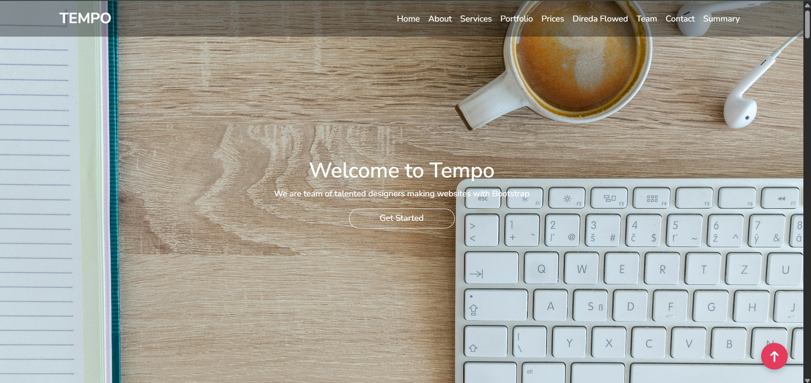
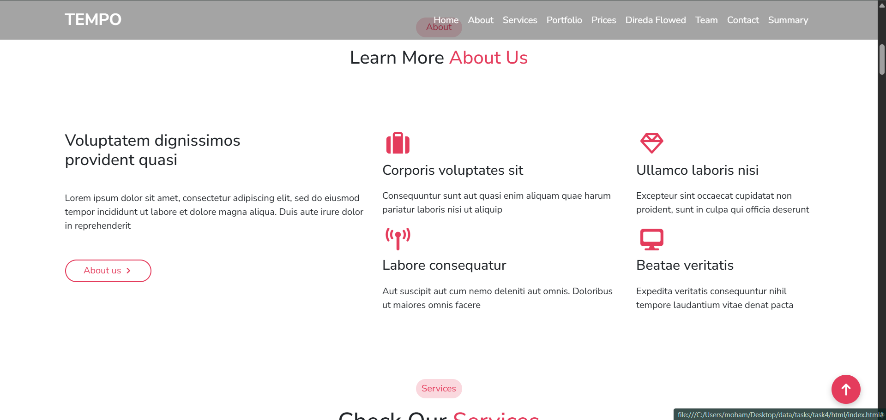
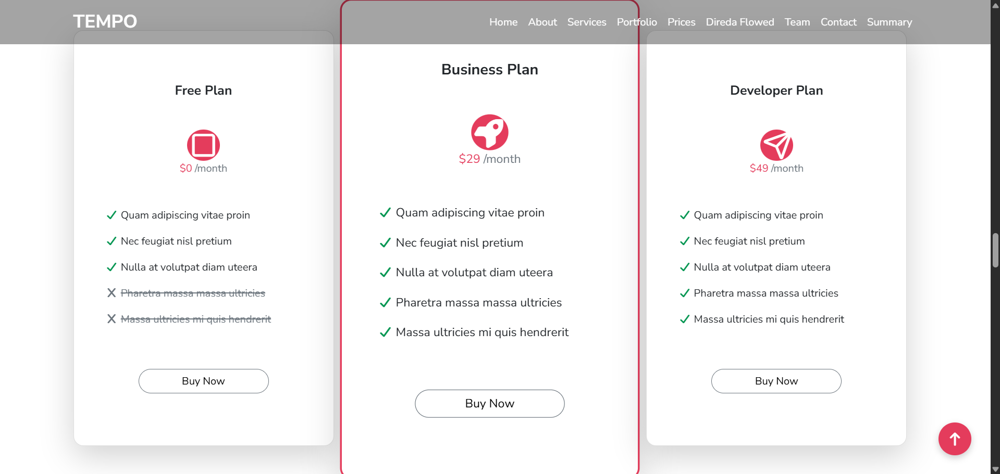

# Frontend Practice Website

A responsive website built using **HTML, CSS, Bootstrap, Font Awesome**, and advanced **Flexbox layouts** enriched with **AOS animations** for smooth scrolling experiences.

## Features
- Fully responsive design for desktops, tablets, and mobile devices
- Smooth scroll animations using **AOS library**
- Modern UI with **interactive elements** and hover effects
- Well-structured layouts using **advanced Flexbox techniques**
- Integration of **Font Awesome** icons for visual enhancement

## Skills Applied
- HTML5
- CSS3
- Bootstrap 5
- Flexbox
- Font Awesome
- AOS (Animate on Scroll) library
- Responsive web design

## Screenshots

## Live Demo
[Add link here if deployed on GitHub Pages or Vercel]

## GitHub Repository
[https://github.com/Mo7amed-Aboelsoud/frontend-practice-website.git](https://github.com/YourUsername/frontend-practice-website)

## Notes
- All code is written by me for practice purposes.
- The project demonstrates frontend skills and layout design capabilities.
- Designed to be easily extendable for future enhancements.